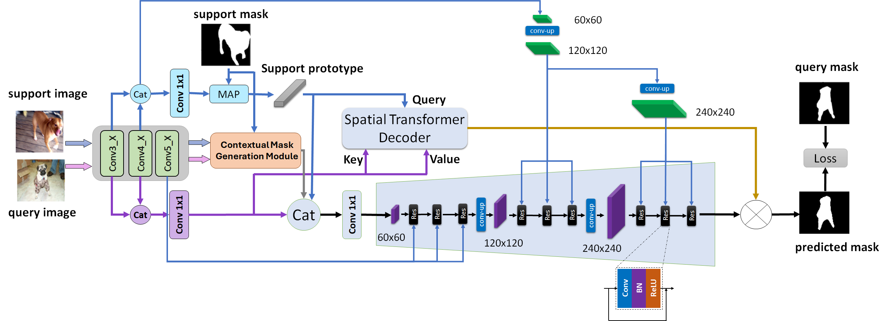

## CDMDNet: Cross-Domain Multi-scale Decoder for Few-Shot Semantic Segmentation via Transformer-Guided Prototyping
This is the implementation of the paper "CDMDNet: Cross-Domain Multi-scale Decoder for Few-Shot Semantic Segmentation via Transformer-Guided Prototyping" by Fateh Amirreza, Mohammadi Mohammadreza, Jahed-Motlagh Mohammadreza.

<p align="middle">
    
</p>
For more information, check out our paper on [[arXiv](...)].

## Requirements

- Python 3.8.18
- PyTorch 1.8.1
- cuda 11.5
- tensorboard 2.12.1
- numpy 1.22.3

Conda environment settings:
```bash
conda create -n cdmd python=3.8
conda activate cdmd

conda install pytorch=1.8.1 torchvision cudatoolkit=11.5 -c pytorch
conda install -c conda-forge tensorflow
pip install tensorboardX
```
## Preparing Few-Shot Segmentation Datasets
Download following datasets:

> #### 1. PASCAL-5<sup>i</sup>
> Download PASCAL VOC2012 devkit (train/val data):
> ```bash
> wget http://host.robots.ox.ac.uk/pascal/VOC/voc2012/VOCtrainval_11-May-2012.tar
> ```
> Download PASCAL VOC2012 SDS extended mask annotations from this [[Google Drive](https://drive.google.com/file/d/10zxG2VExoEZUeyQl_uXga2OWHjGeZaf2/view?usp=sharing)].

> #### 2. COCO-20<sup>i</sup>
> Download COCO2014 train/val images and annotations: 
> ```bash
> wget http://images.cocodataset.org/zips/train2014.zip
> wget http://images.cocodataset.org/zips/val2014.zip
> wget http://images.cocodataset.org/annotations/annotations_trainval2014.zip
> ```
> Download COCO2014 train/val annotations from our Google Drive: [[train2014.zip](https://drive.google.com/file/d/1cwup51kcr4m7v9jO14ArpxKMA4O3-Uge/view?usp=sharing)], [[val2014.zip](https://drive.google.com/file/d/1PNw4U3T2MhzAEBWGGgceXvYU3cZ7mJL1/view?usp=sharing)].
> (and locate both train2014/ and val2014/ under annotations/ directory).


Create a directory '../Datasets' for the above two few-shot segmentation datasets and appropriately place each dataset to have following directory structure:

    ../                         # parent directory
    ├── ./                      # current (project) directory
    │   ├── common/             # (dir.) helper functions
    │   ├── data/               # (dir.) dataloaders and splits for each FSSS dataset
    │   ├── model/              # (dir.) implementation of ProtoFormer model 
    │   ├── README.md           # intstruction for reproduction
    │   ├── train.py            # code for training HSNet
    │   └── test.py             # code for testing HSNet
    └── Datasets/
        ├── VOC2012/            # PASCAL VOC2012 devkit
        │   ├── Annotations/
        │   ├── ImageSets/
        │   ├── ...
        │   └── SegmentationClassAug/
        ├── COCO2014/           
            ├── annotations/
            │   ├── train2014/  # (dir.) training masks (from Google Drive) 
            │   ├── val2014/    # (dir.) validation masks (from Google Drive)
            │   └── ..some json files..
            ├── train2014/
            └── val2014/

Download the ImageNet pretrained ([**backbone-resnet50**](https://drive.google.com/file/d/1Mq_6NXZKw5TUcpLQ8MuOK3KbQ_WeXmwr/view?usp=sharing), [**backbone-resnet101**](https://drive.google.com/file/d/1SJCDL1eu1ygYsdRESEDzTBJfqOp2MPe8/view?usp=sharing)) and put them into the `initmodel` directory

## Training
> ### 1. PASCAL-5<sup>i</sup>
> ```bash
> python train.py --layers {50, 101} 
>                 --fold {0, 1, 2, 3} 
>                 --benchmark pascal
>                 --lr 1e-3
>                 --bsz 32
>                 --niter 60
>                 --shot 1
>                 --logpath "your_experiment_name"
> ```


> ### 2. COCO-20<sup>i</sup>
> ```bash
> python train.py --layers {50, 101} 
>                 --fold {0, 1, 2, 3} 
>                 --benchmark coco 
>                 --lr 1e-3
>                 --bsz 32
>                 --niter 30
>                 --shot {1, 5}
>                 --logpath "your_experiment_name"
> ```

> ### 3. Cross Domain COCO-20<sup>i</sup> to PASCAL-5<sup>i</sup>
> Note: For this task, you should use the `new_coco` dataset, which excludes classes present in PASCAL-5<sup>i</sup>.
> ```bash
> python train.py --layers {50, 101} 
>                 --fold {0, 1, 2, 3} 
>                 --benchmark coco 
>                 --lr 1e-3
>                 --bsz 32
>                 --niter 30
>                 --shot {1, 5}
>                 --logpath "your_experiment_name"
> ```


> ### Babysitting training:
> Use tensorboard to babysit training progress:
> - For each experiment, a directory that logs training progress will be automatically generated under logs/ directory. 
> - From terminal, run 'tensorboard --logdir logs/' to monitor the training progress.
> - Choose the best model when the validation (mIoU) curve starts to saturate. 


## Testing

> ### 1. PASCAL-5<sup>i</sup>
> ```bash
> python test.py --layers {50, 101} 
>                --fold {0, 1, 2, 3} 
>                --benchmark pascal
>                --nshot {1, 5} 
>                --load "path_to_trained_model"
> ```


> ### 2. COCO-20<sup>i</sup>
> ```bash
> python test.py --layers {50, 101}
>                --fold {0, 1, 2, 3} 
>                --benchmark coco 
>                --nshot {1, 5} 
>                --load "path_to_trained_model"
> ```

## Acknowledgements
This project is built upon HSNet:https://github.com/juhongm999/hsnet and ProtoFormer:https://github.com/LeileiCao/ProtoFormer
